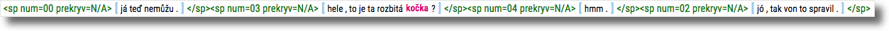
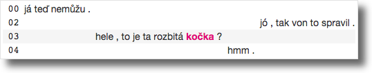
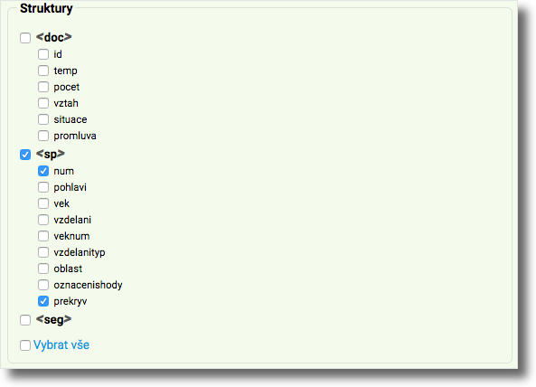

Skip [here](#english) for English. If reading this on github, the app is live
[here](http://trost.korpus.cz/shiny/lukes/mluvkonk).

# Shrnutí

Nástroj MluvKonk slouží k tomu, abyste si konkordance z mluvených korpusů
[ČNK](http://korpus.cz) řady [ORAL](http://wiki.korpus.cz/doku.php/cnk:oral2013)
vytvořené pomocí rozhraní [KonText](https://kontext.korpus.cz) mohli zobrazit ve
formátu, který intuitivněji a přehledněji naznačuje strukturu dialogu (střídání
mluvčích, překryvy atp.) než konkordance přímo v KonTextu.

Obrázek napoví víc -- úlohou MluvKonku je změnit toto...

... na toto:

V MluvKonku má každý mluvčí svou vlastní vrstvu (označenou jeho číslem, `00`,
`01` atd.) a lze tedy jednodušeji sledovat, kdo na koho reaguje, která slova
byla pronesena zároveň atp.

#  Návod

Chcete-li do MluvKonku nahrát vlastní konkordanci, níže je popsán potřebný
postup. Než se do něj pustíte, vězte, že vyžaduje, abyste byli [registrovanými
uživateli ČNK](https://www.korpus.cz/toolbar/signup.php) a přihlášeni do
aplikace KonText.

V aplikaci [**KonText**](https://kontext.korpus.cz):

  1. Vyhledejte libovolným způsobem nějaký dotaz v mluvených korpusech.

  2. V menu klepněte na **Zobrazení → Atributy, struktury a metainformace...**.

  3. V rámečku **Struktury** zatrhněte struktury `sp.num` a `sp.prekryv`:

  

  4. Volbu potvrdíte kliknutím na **Použít volby zobrazení** na konci stránky:

  

  5. V menu klepněte na **Uložit → CSV** a konkordanci si ve formátu `.csv`
  stáhněte. Nezapomeňte si poznamenat, kam jste ji uložili.

Zde v nástroji **MluvKonk**:

  1. Klepněte na záložku **Konkordance**.

  2. Klepněte na **Vybrat soubor** pod nadpisem **Nahrát vlastní konkordanci**.

  3. Vyberte konkordanci ve formátu `.csv`, kterou jste si před chvílí stáhli
  z KonTextu.

  4. MluvKonk zobrazuje najednou pouze omezené množství výsledků; navigovat
  v konkordanci můžete pomocí posunovátka nadepsaného **Vybrat stránku**.

# Omezení

V některých případech není na základě konkordance možné určit, kterému mluvčímu
patří první replika v levém kontextu. Potom je taková replika uvedena
v samostatné vrstvě s číslem mluvčího `??`. Jestli je mluvčí `??` totožný
s nějakým ze známých mluvčích musí už uživatel rozhodnout sám na základě obsahu
(např. tématická či přímo syntaktická návaznost úseků).

MluvKonk je zatím spíš na hraní, když mu dáte příliš velkou konkordanci (desítky
tisíc výskytů), bude mu chvíli trvat, než si s ní poradí, a pokud soubor
přesáhne jistou velikost, nenahraje ji vůbec. Snažte se tedy před nahráním
konkordanci pečlivě
[profiltrovat](http://wiki.korpus.cz/doku.php/manualy:kontext:filtr), aby v ní
bylo skutečně jen to, co vás zajímá, nebo jednoduše kus souboru `.csv` umazat.
Desítky tisíc výskytů stejně není v lidských silách pečlivě ručně projít.

Pokud narazíte na problémy, kontaktujte prosím
[autora](https://trnka.korpus.cz/~lukes).

#  English

MluvKonk is a tool for converting [CNC](http://korpus.cz) spoken corpus
concordances into a more user-friendly viewing format than that offered by the
[KonText](https://kontext.korpus.cz) concordancer. Visually speaking, its
purpose is to turn this...

... into this:

Unless you speak Czech and/or do research on Czech (in which case, the Czech
instructions are right [here](#navod)), it is unlikely to be of much use to you.
If you're interested in the [Shiny](http://shiny.rstudio.com/) side of things
though, [drop me a line on github](https://github.com/dlukes/)!
